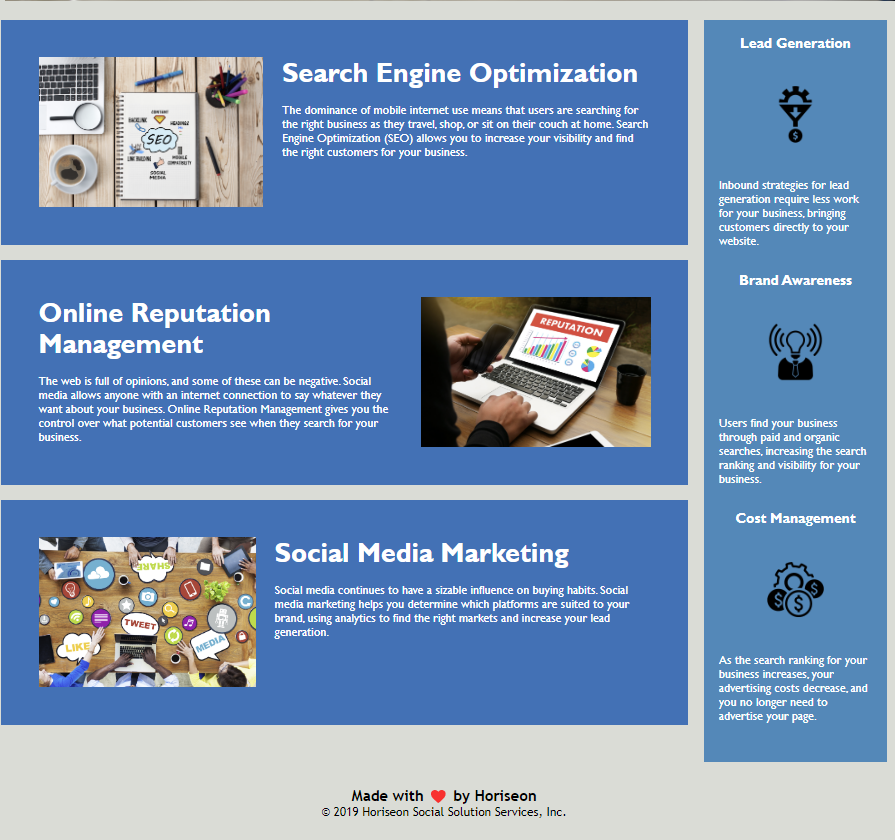

# HTML CSS Git Challenge: Code Refactor🔥

## Table of Content

- [Description](#description)
- [Website Preview](#website-preview)

  - [Image of A Business Meeting Page](#image-of-a-business-meeting-page)
  - [Image of Other Contents Page](#image-of-other-contents-page)

- [Features](#features)
- [Installation and Deployment](#installation-and-deployment)
- [Sections](#sections)
- [Tools Used](#tools-used)
- [Contributing](#contributing)
- [License](#license)
- [Questions](#questions)

## Description

The Horiseon Social Solution Services website code in this repository has been refactored  
to make it more accessible for people with disabilities. The Horiseon website can now be  
accessed by people with disabilities through assistive technologies such as video captions,  
screen readers, and braille keyboards. Adding this feature to the website will ensure that  
the website appears higher in search engine results, such as Google. 
I improved functionality by modifying the codebase, which previously had some imperfections. 
Previously, the navigation bar links did not work, but now they will take users to the right  
place on the site. You can now see that semantic HTML elements are being used and are positioned  
logically in the source code. The page has also been given a new title, which reads "Horiseon  
Social Solution Services". This code is now more efficient, and the website will be more durable  
for the long run.

## Website Preview

 

### Image of A Business Meeting Page

   

### Image of Other Contents Page

   

## Features

# 📋

⚡️ Accesible  
⚡️ Efficient  
⚡️ Easy to read  
⚡️ Valid HTML5 & CSS3  
⚡️ Easy to modify

## Installation and Deployment

# 📦

- git clone the repo to your local so that you have the project
- Modify the content of index.html
- Add or remove images from assets/img/ directory as per your requirement
- Make changes to the details of the projects folder according to your needs
- Using Github Pages, you can build your own website.
- To deploy your website, push the generated code to the master or main branch.

You can clone the most recent version of repo into your machine

- https://github.com/ghashe/urban-octo-telegram/

Use the following link to open it in your browser

- https://ghashe.github.io/urban-octo-telegram/

## Sections

# 📚

    ✔️ Business Meeting Page
    ✔️ Other Contents Page
    ✔️ Footer

## Tools Used

# 🛠️

    ✔️ HTM
    ✔️ CSS

## Contributing

# 💡

It would be great if you could contribute in any way

- 👯 Git clone the repo to your local machine
- 🔨🔨🔨 Develop your code
- 🔃 Create a new pull request.

## License

    MIT license has been applied to this project

## Questions

If you have any questions, feel free to contact me via the following contact information:

- Emain: emandaabyou@gmail.com
- GitHub account: [ghashe](https://github.com/ghashe)
- Linkedin: https://www.linkedin.com/in/abyou-geletu-5ba16622b

---

_This README has been generated by ❤ [Professional-README-generator](https://github.com/ghashe/professional-README-generator) © 2022_

---
